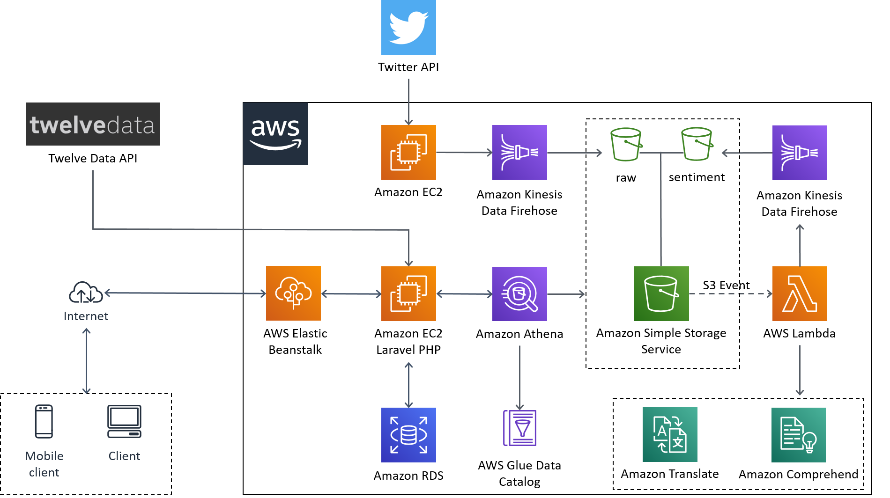

# Stock Tracker with Twitter Analysis
This practical problem-solving project was created for the course *Cloud Computing* at the RMIT University.

## Project Description

## Architecture

## Cloud Services
The entire project is built upon AWS Cloud Services and uses the following services:

 - AWS CloudFormation
 - AWS Elastic Beanstalk
 - AWS EC2
 - AWS Kinesis
 - AWS Lambda
 - AWS Comprehend
 - AWS Translate
 - AWS Glue
 - AWS Athena
 
Storage & Database:
 - AWS S3
 - AWS RDS (MySQL)

## Content
***Deployment:***
> Resources for the deployment of the entire application

***Source:***
> Source code for the twitter streaming and sentiment analysis

***Webapp:***
> Source code for the web application using **Laravel**

## References
Inspirations and code references used for this project:

***Twitter-Sentiment-Analysis:***

- [AI-Driven Social Media Dashboard](https://github.com/amazon-archives/ai-driven-social-media-dashboard)

***Financial Data API***

- [Alpha Vantage PHP Client](https://github.com/kokspflanze/alpha-vantage-api) *(Adapted to Twelve Data)*
- [Twelve Data](https://twelvedata.com/)

***Stock Timeseries Visualization***

- [Historical Price Charts with D3.js](https://github.com/wentjun/d3-historical-prices)
- [Relevant Tutorial](https://www.freecodecamp.org/news/how-to-build-historical-price-charts-with-d3-js-72214aaf6ba3/)
- [Responsive Chart](https://brendansudol.com/writing/responsive-d3)
